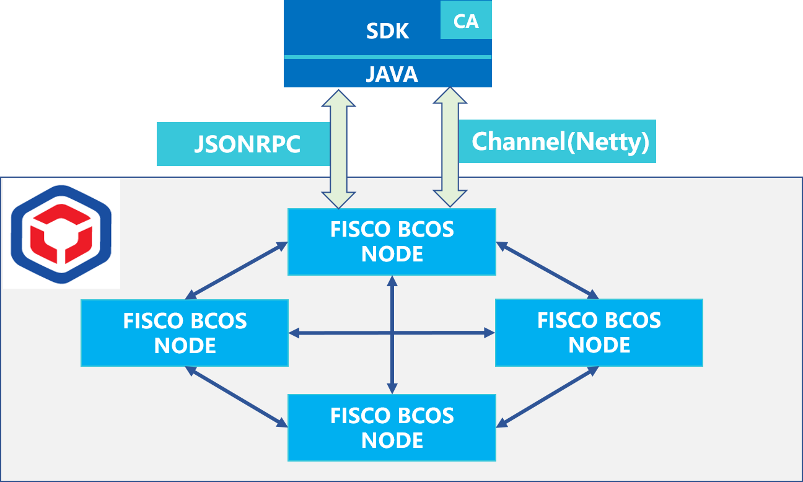

[English](../README.md) / 中文

# Web3SDK

[](http://makeapullrequest.com)
[](https://travis-ci.org/FISCO-BCOS/web3sdk)
[](https://www.codefactor.io/repository/github/fisco-bcos/web3sdk)
[](https://www.codacy.com/app/fisco/console?utm_source=github.com&amp;utm_medium=referral&amp;utm_content=FISCO-BCOS/console&amp;utm_campaign=Badge_Grade)
[](https://github.com/FISCO-BCOS/web3sdk)
---
Web3SDK为[FISCO BCOS](https://github.com/FISCO-BCOS/FISCO-BCOS/tree/master)提供Java API。利用FISCO BCOS JAVA SDK可以简单快捷的基于FISCO-BCOS进行区块链应用开发。**此版本只支持**[FISCO BCOS 2.0+](https://fisco-bcos-documentation.readthedocs.io/zh_CN/latest/docs/introduction.html)。


<div align="center">
  
</div>

## 关键特性

- 实现FISCO BCOS的[JSON-RPC](https://fisco-bcos-documentation.readthedocs.io/zh_CN/latest/docs/api.html)的Java API。
- 支持[预编译合约](https://fisco-bcos-documentation.readthedocs.io/zh_CN/latest/docs/manual/smart_contract.html#id2)管理区块链。
- 支持[链上信使协议](https://fisco-bcos-documentation.readthedocs.io/zh_CN/latest/docs/manual/amop_protocol.html)为联盟链提供安全高效的消息信道。
- 支持使用[国密算法](https://fisco-bcos-documentation.readthedocs.io/zh_CN/latest/docs/manual/guomi_crypto.html)发送交易。

## 源码编译

**环境要求**:
  - [JDK8及以上](https://fisco-bcos-documentation.readthedocs.io/zh_CN/latest/docs/sdk/java_sdk.html#id1)
  - Gradle 5.0及以上

**编译运行如下命令**:
```shell
$ cd web3sdk
$ ./gradlew build
```
**编译结果**: 
编译的web3sdk jar位于:
```shell
web3sdk/dist/apps/web3sdk.jar
```

## 文档
- [**英文**](https://fisco-bcos-documentation.readthedocs.io/en/latest/docs/sdk/java_sdk.html)
- [**中文**](https://fisco-bcos-documentation.readthedocs.io/zh_CN/latest/docs/sdk/java_sdk.html)


## 快速入门
提供基于SDK的[spring boot starter](https://github.com/FISCO-BCOS/spring-boot-starter)示例项目，示例项目使用了SDK的核心特性, 包括:

- 如何连接FISCO BCOS区块链节点。
- 在区块链网络中部署合约。
- 读取部署合约的变量值。
- 更新部署合约的变量值。
- 提供SDK API接口的测试案例。

## 贡献代码
欢迎参与FISCO BCOS的社区建设：
- 如项目对您有帮助，欢迎点亮我们的小星星(点击项目左上方Star按钮)。
- 提交代码(Pull requests)，参考我们的[代码贡献流程](CONTRIBUTING_CN.md)。
- [提问和提交BUG](https://github.com/FISCO-BCOS/web3sdk/issues/new)。

## 加入我们的社区

FISCO BCOS开源社区是国内活跃的开源社区，社区长期为机构和个人开发者提供各类支持与帮助。已有来自各行业的数千名技术爱好者在研究和使用FISCO BCOS。如您对FISCO BCOS开源技术及应用感兴趣，欢迎加入社区获得更多支持与帮助。


## License


Web3SDK的开源协议为[Apache License 2.0](http://www.apache.org/licenses/). 详情参考[LICENSE](../LICENSE)。